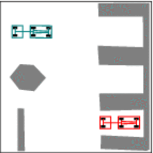

# Valet-Parking
This repository contains my Implementation of hybrid A star for a vehicle with Ackerman steering to perform complex parking maneuvers in tight parking spaces.
## Instructions
1. Install all the required packages using requirements.txt (python version: 3.9.13)
2. run python valet_demo.py

## Results:
1. Hybrid A star search pattern:

2. Demo Video

3. Truck Parking

